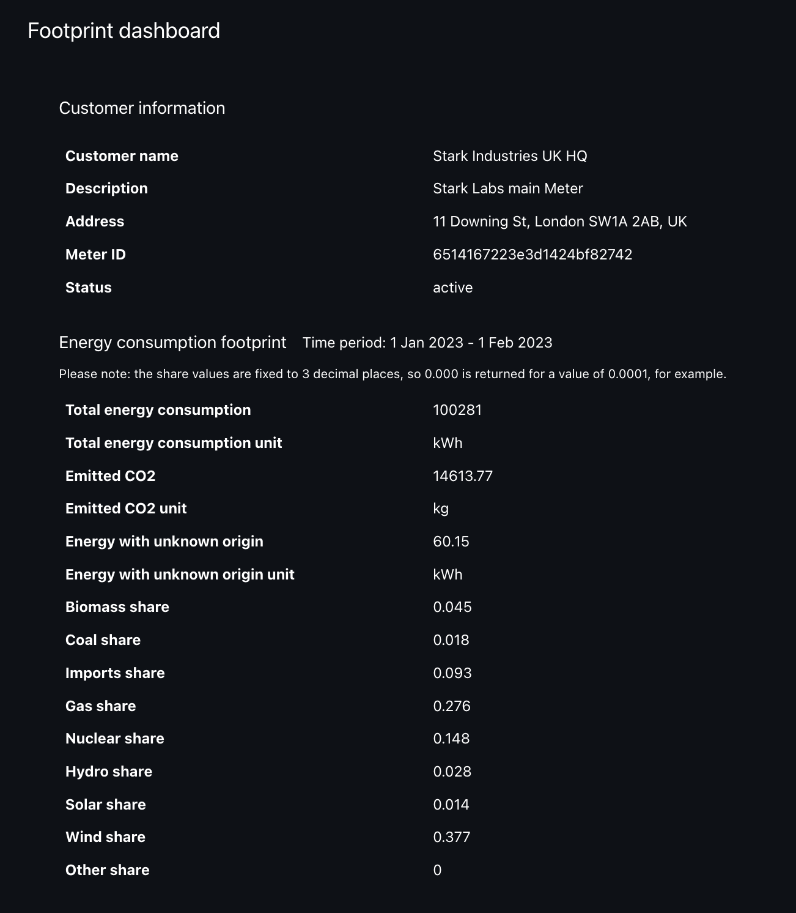

# Energy Footprint Calculator - Frontend

It is a simple dashboard written in Vue using TypeScript.

Given a `meter_id` and a `start_date` and `end_date` it returns the energy footprint of the meter in the given period.

The footprint consists of the following properties:
* total energy consumption
* total CO2 emitted
* the fuel mix based on the National Grid's fuel mix data.



The **total energy** consumption is calculated by summing up the energy consumption of the meter in the given period.

The **total amount of CO2** (kgs) emitted by the electricity generated for the given meter in the given period
is calculated by taking the sum of the multiplication of the energy consumption of the meter in half-hourly
intervals by the matching half-hourly CO2 average levels of the National Grid's CO2 level data.

The **fuel mix** is calculated by taking the sum of the multiplication of the energy consumption of the meter in half-hourly
intervals by the matching half-hourly fuel mix of the National Grid's fuel mix data.

## Prerequisites

In order to run the Dashboard Frontend locally you need to have the Dashboard Backend running locally as well.

The code for the Dashboard Backend is available [here](https://github.com/melnikovkolya/openvolt-dashboard-backend).


## Installation

Clone the repository and navigate into it.

Run

```bash
npm install
```

to install all of the dependency packages.

## Usage

```bash
npm run dev
```
to start the server in development mode at `http://localhost:5173/`.


#### Notes
* the share values are fixed to 2 decimal places, so 0.00% is returned for a value of 0.0001%.
* the `energyWithUnknownOrigin` is calculated by subtracting the sum of the `generationMix` with accounted origin from the `totalEnergyConsumption`.
* either `meter_id` or a combination of (`meter_number` and `customer_id`) must be provided. For the purpose of this example we only make use of the `meter_id` query parameter.
* `lookback` is an alternative to `start_date` and `end_date` and it is used to calculate the `start_date` and `end_date` based on the current date.
  In this example we only make use of the `start_date` and `end_date` query parameters.
* `granularity` value of `hh` is the only supported value at the moment.
* `start_date` and `end_date` must be provided in the ISO 8601 format.
